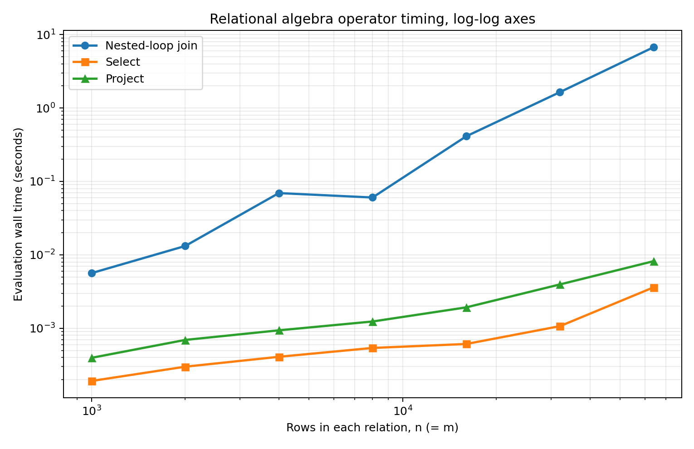

# REPORT.md — Java performance study

## Machine, runtime, and measurement method

I ran the final experiment on 2026-09-29 at 14:15 UTC in a sandboxed x86_64 Linux container (Linux 6.18.44, nine visible logical CPUs; the host CPU model is not exposed). The engine and data generator were compiled for Java 17 with javac 17.0.20 and ran on OpenJDK 17.0.20 HotSpot with its default JIT. Python 3.12.14 orchestrated the measurements; matplotlib 3.10.8 plotted them.

The engine uses System.nanoTime to time **query evaluation only**. Generation, relation-file loading, scanning, parsing, and printing are excluded. Join times below are medians of three separate timed evaluations after one complete warmup evaluation per invocation at each size. Selection and projection numbers are medians of seven invocations; in each invocation the engine warms up for three evaluations and times a batch of 50, reporting the mean per evaluation. The selection counter comes from one evaluation in that batch and equals the number of rows checked by that operator. For the match-rate experiment, each reported wall time is the median of three timed runs after one warmup each.

All main inputs came from the included generator with seed 3005 and target match rate 0.05. The rate is the mean number of matching S tuples for each R tuple; for this run it produces exactly 0.05n output tuples. The query was `R join[R.b=S.b] S`. Both relations have exactly n distinct rows. The join binds attribute positions once; for this numeric equality predicate, it compares cached long keys in a nested loop and increments a counter inside the loop for every pair. It does not use an index, hash join, sort-merge join, or algebra rewrite.

The original measured data and machine metadata are [docs/measurements.csv](docs/measurements.csv), [docs/match_rate.csv](docs/match_rate.csv), and [docs/benchmark_metadata.json](docs/benchmark_metadata.json). Reproduce the experiment with `make && python3 tools/benchmark.py`.

## Required seven-size experiment

| n | m | Measured join comparisons | Join wall time (s) | Output tuples |
| ---: | ---: | ---: | ---: | ---: |
| 1,000 | 1,000 | 1,000,000 | 0.005631506 | 50 |
| 2,000 | 2,000 | 4,000,000 | 0.013185856 | 100 |
| 4,000 | 4,000 | 16,000,000 | 0.069349961 | 200 |
| 8,000 | 8,000 | 64,000,000 | 0.060353147 | 400 |
| 16,000 | 16,000 | 256,000,000 | 0.411571644 | 800 |
| 32,000 | 32,000 | 1,024,000,000 | 1.643568398 | 1,600 |
| 64,000 | 64,000 | 4,096,000,000 | 6.730319568 | 3,200 |

### 1. Exact comparison relationship

For each of n left tuples, a nested-loop join evaluates its predicate on all m right tuples. The source increments `join_1_comparisons` once for each pair, even when the pair fails the condition. Therefore the count is **C(n,m) = n × m**. The measured counts match exactly, including 64,000 × 64,000 = 4,096,000,000; no discrepancy needs explaining.

### 2. Log-log plot and slope

A least-squares line over **all seven** log(n), log(time) join points has slope **1.6843**. Over the three largest sizes (16,000 to 64,000), the endpoint log slope is **2.0157**: time grows from 0.411571644 s to 6.730319568 s when n grows fourfold. That large-size slope agrees closely with the quadratic pair count. The seven-point slope is shallower because these are short Java invocations with changing HotSpot JIT and fixed setup costs inside evaluation. Even three timed runs after warmup did not make small-size timings uniformly increase: 8,000 was faster than 4,000 in this experiment. A measured slope is not a proof that this implementation has subquadratic pair count. The counter directly establishes n² predicate evaluations for n = m.

### 3. Selection and projection at the same sizes

Standalone queries were `select[a>=0](R)` and `project[a](R)`. Every R tuple satisfies selection; `a` is unique so every projected tuple survives. The select counter inside the operator was n for each tested size, not an estimated value.

| n | Select evaluations | Select median per evaluation (s) | Project median per evaluation (s) |
| ---: | ---: | ---: | ---: |
| 1,000 | 1,000 | 0.000191515 | 0.000395630 |
| 2,000 | 2,000 | 0.000299687 | 0.000693603 |
| 4,000 | 4,000 | 0.000408828 | 0.000937510 |
| 8,000 | 8,000 | 0.000539632 | 0.001236693 |
| 16,000 | 16,000 | 0.000610952 | 0.001925741 |
| 32,000 | 32,000 | 0.001068490 | 0.003954203 |
| 64,000 | 64,000 | 0.003611547 | 0.008200589 |

The fitted slopes over all seven points are **0.6057** for selection and **0.6851** for projection. They are empirical slopes over short timings that include per-evaluation fixed work and JIT effects; they do not mean these operators are asymptotically sublinear. The code visits n rows for selection and n rows for projection, while projection additionally hashes and checks each candidate output tuple using explicit tuple equality. Both curves are much flatter than the join and remain below 0.009 seconds at 64,000 rows in this experiment. Longer and larger repeated runs would help estimate their asymptotic slopes more reliably.

### 4. Estimate one million rows on each side

**This size was predicted, not executed.** It requires 1,000,000 × 1,000,000 = **1,000,000,000,000** pair comparisons. Using the measured 64,000-row evaluation time and holding time per pair approximately constant:

~~~text
ratio of pair counts = 1,000,000,000,000 / 4,096,000,000
                     = 244.140625

predicted time = 6.730319568 s × 244.140625
               = 1,643.144426 s
               ≈ 27.39 minutes
~~~

This extrapolation assumes the optimized numeric equality path, similar match rate, and similar cost per pair. Bigger arrays may change cache behavior; HotSpot compilation, garbage collection, and output size may also change wall time. The result is an estimate from this Java run, not a promise.

### 5. Changing the match rate

I generated n = m = 8,000 at three rates, running the same query each time:

| Mean S matches per R | Measured comparisons | Output tuples | Median wall time (s) |
| ---: | ---: | ---: | ---: |
| 0 | 64,000,000 | 0 | 0.034858578 |
| 0.05 | 64,000,000 | 400 | 0.063258342 |
| 1 | 64,000,000 | 8,000 | 0.233104801 |

The comparison count stays exactly 64,000,000 because every pair reaches the comparison, regardless of whether it matches. Wall time can change because a successful comparison constructs and stores an output tuple, changes branch behavior, and can affect JVM compilation and memory management. These are medians of only three separate runs, so the table shows observed timing rather than isolating a single cause. The output count rises with the rate as designed.

### 6. A practical route to a larger join

For an equality predicate, a future hash join could build a table keyed by `b` on one input and probe it with rows from the other. With enough memory and reasonable hashing, expected work would be O(n + m + output rows) instead of inspecting a trillion pairs. Indexes or a sort-merge join could be appropriate under different storage and ordering constraints. This component deliberately implements the requested nested-loop execution of the user's parse tree.

## Reproduction boundaries

The generator prints the exact match rate and expected join output. The benchmark checks those outputs and the join comparison counts before saving its CSV files and plot. This report describes one environment and one benchmark run; re-running on another machine or JVM can yield different wall times while the pair-count formula stays exact.
